# HireSense - AI Resume Screening Platform (Node.js & Express)

HireSense is a production-grade, self-contained AI-powered resume screening and candidate ranking system built using Node.js, Express, and `@xenova/transformers`. It parses uploaded candidate PDF resumes asynchronously, indexes textual chunks semantically into a local vector store, and scores candidates against job description requirements using a multi-criteria composite ranking algorithm.

## Features

- **Asynchronous PDF Ingestion:** Non-blocking background workers process candidate resumes, extract metadata, and calculate embeddings.
- **Semantic Text Chunking:** Splits extracted PDF texts into overlapping chunks to capture localized semantic contexts accurately.
- **Dense Vector Search:** Uses `@xenova/transformers` (local execution of `Xenova/all-MiniLM-L6-v2` ONNX models) and vector dot-product similarity to perform high-speed cosine similarity searches.
- **Composite Ranking Engine:** Computes a weighted candidate ranking score combining:
  - **Semantic Match (60%):** Vector similarity of resume chunks to the job title, requirements, and responsibilities.
  - **Skills Alignment (30%):** Automated keyword intersection of parsed candidate skill sets against required skills.
  - **Experience Heuristic (10%):** Alignment of parsed candidate experience years with the job profile goals.
- **Premium Glassmorphic UI:** A dark-themed, highly interactive dashboard utilizing Outfit typography, glass panels, dynamic indicators, circular match meters, and expandable semantic gap analyses.

---

## System Flow & Architecture

```mermaid
sequenceDiagram
    actor Recruiter as Recruiter (UI)
    participant API as Express Backend
    participant Worker as Background Parser
    participant Model as ONNX Model (@xenova/transformers)
    participant DB as Vector Store (vector_store.json)

    %% Job creation
    Recruiter->>API: 1. Create Job Description
    API->>DB: Save job JSON to disk
    API-->>Recruiter: Job Profile Created

    %% Resume ingestion
    Recruiter->>API: 2. Upload Resumes (PDFs)
    API-->>Recruiter: Immediate response (Enqueued)
    
    %% Async worker activity
    rect rgb(30, 30, 45)
        note right of API: Async Background Task Started
        API->>Worker: Parse pdf-parse
        Worker->>Worker: Extract text, parse contact info & skills
        Worker->>Worker: Chunk text into overlapping segments
        Worker->>Model: Encode text chunks into embeddings
        Model-->>Worker: Return float vectors
        Worker->>DB: Save candidate JSON & index vectors
    end

    %% Ranking
    Recruiter->>API: 3. Select Job Profile (Rank trigger)
    API->>DB: Fetch all candidates & job details
    API->>Model: Encode job description query
    Model-->>API: Job query vector
    API->>DB: Search vectors (cosine similarity)
    API->>API: Calculate Composite Score (Semantic 60% + Skills 30% + Exp 10%)
    API-->>Recruiter: Return ranked candidates leaderboard
```



---

## Getting Started

### Prerequisites
- Node.js v18 or higher

### Installation & Setup

1. **Install Dependencies:**
   ```bash
   npm install
   ```

2. **Start the Express Application:**
   ```bash
   npm start
   ```

3. **Access the Dashboard:**
   Open [http://127.0.0.1:8000](http://127.0.0.1:8000) in your web browser.

---

## Directory Structure

```
HireSense/
├── src/
│   ├── server.js                # Express app initialization and routes
│   ├── config.js                # App configurations & storage directories
│   └── services/
│       ├── pdfParser.js         # PDF text extractor, info parser, chunking
│       ├── vectorStore.js       # JS Vector database and similarity search
│       └── ranker.js            # Composite scoring & logic module
├── app/
│   └── static/
│       ├── index.html           # Dashboard layout
│       ├── style.css            # Premium glassmorphic stylesheet
│       └── app.js               # Reactive JS engine & client endpoints
├── package.json                 # Node.js project manifest
└── README.md                    # System documentation
```

---

## Core API Endpoints

| Endpoint | Method | Description |
| :--- | :--- | :--- |
| `/api/jobs` | `POST` | Create a new Job Description |
| `/api/jobs` | `GET` | List all existing Job Descriptions |
| `/api/resumes/upload` | `POST` | Upload multiple PDF resumes (asynchronous processing) |
| `/api/resumes/status/:id`| `GET` | Check processing status of a resume |
| `/api/resumes` | `GET` | List all processed Candidate Profiles |
| `/api/jobs/:id/rank` | `POST` | Rank all candidates against the specified Job ID |
